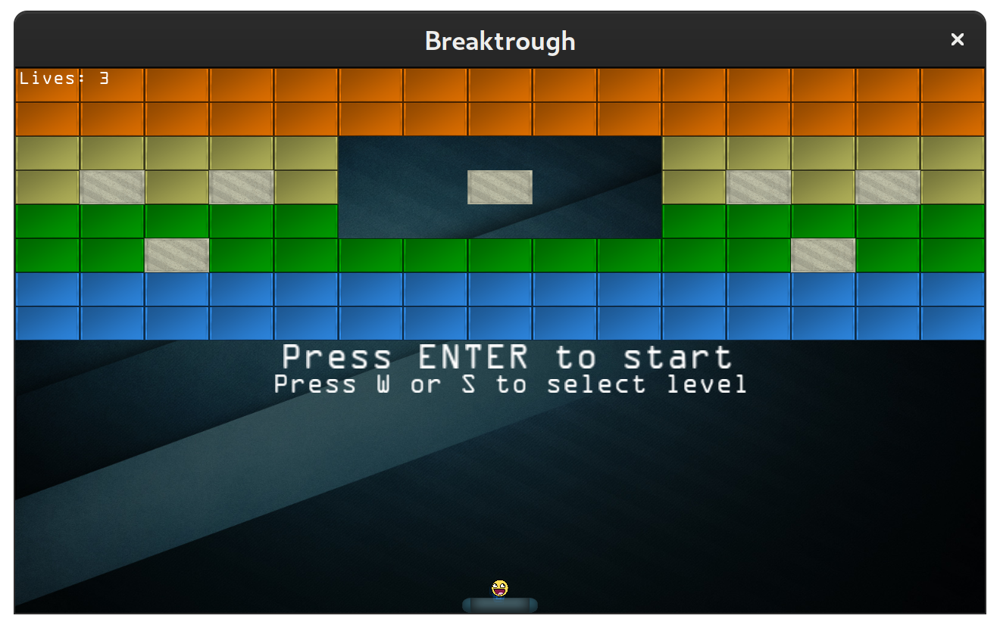
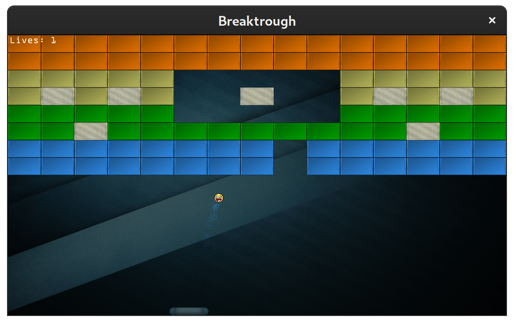

# Breakthrough
## Description
This my version of the Breakthrough game tutorial from
[LearnOpenGL](https://learnopengl.com/In-Practice/2D-Game/Breakout).
I used a slightly different architecture and used OpenAl for Audio
instead of IrrKlang.

## Screenshots



## Features
- 2D Sprite Renderer
- Particle System
- Post-Processing effects
- Collision Detection
- Audio
- Text Rendering

##  Build
```
mkdir build
cd build
cmake -G Ninja ..
ninja
```
## Play
```
cd build
./app/breakthroughgl
```
